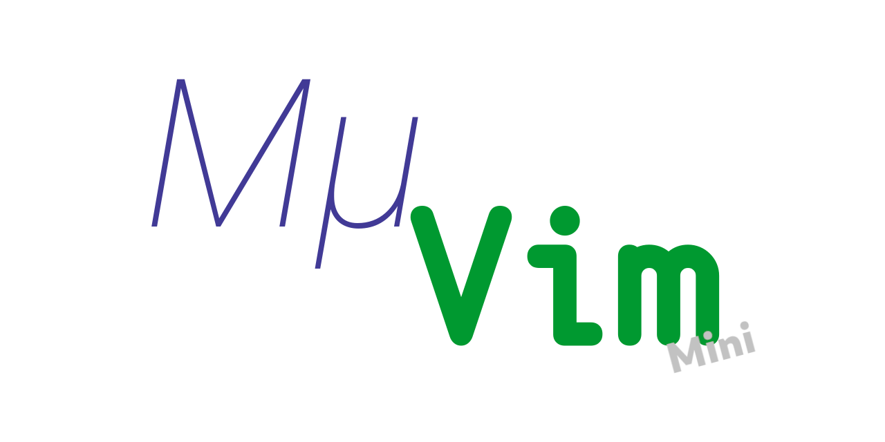
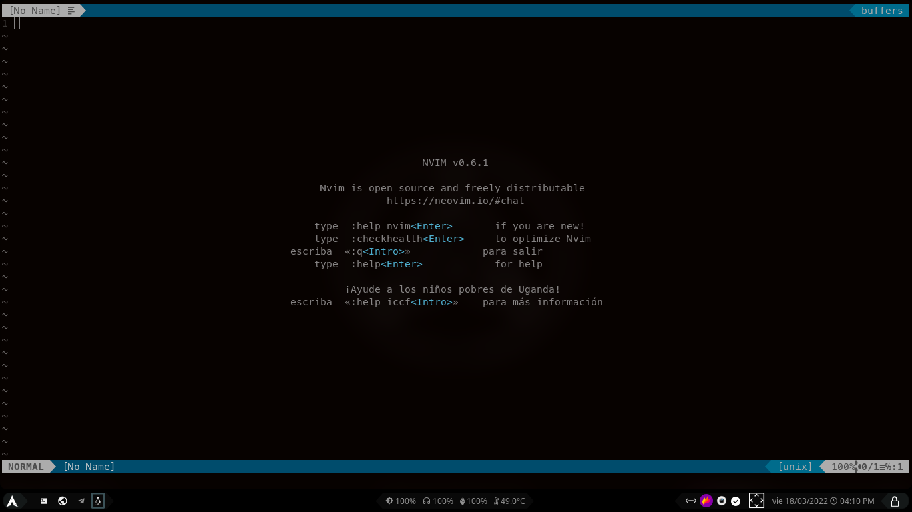
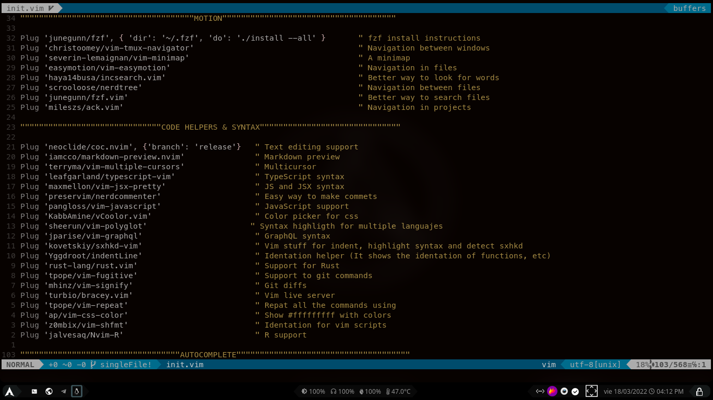
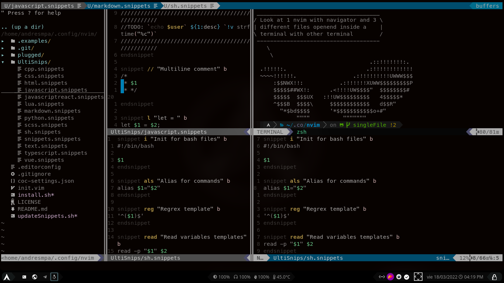
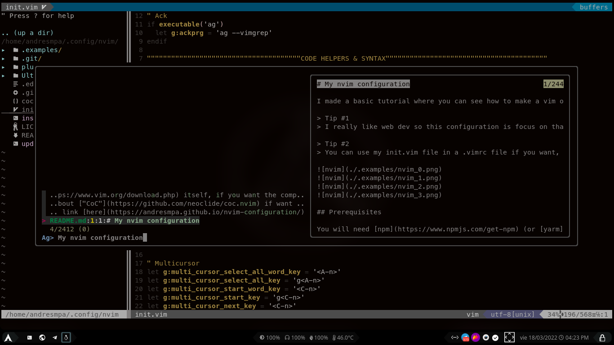

<div align="center">
  <p>
    <a href="https://github.com/AndresMpa/mu-nvim">
      
    </a>
    <a href="https://github.com/AndresMpa/mu-nvim">
      
    </a>
  </p>
</div>

MμVim is three editor configs. This repository is **Mini**: one `init.vim` for Vim and Neovim, a template, and the one you take to a server.

The other two are [Current](https://github.com/AndresMpa/mu-vim) (Lua, Neovim only) and [VimScript](https://github.com/AndresMpa/mu-vim-vimscript) (modular). Docs: [andresmpa.github.io/mu-vim-page](https://andresmpa.github.io/mu-vim-page/).

## Screenshots






`init.vim` is split into "slides" (comment banners of `"`). Startify is the greeter (`f` find files, `n` file tree, `g` git status).

## Prerequisites

[Neovim](https://github.com/neovim/neovim/wiki/Installing-Neovim) or [Vim](https://www.vim.org/download.php). The installer pulls vim-plug, Node, and pnpm.

## Quick Start

| OS | Package manager | Config dir |
| --- | --- | --- |
| Linux Arch / Manjaro | pacman | `~/.config/nvim` |
| Linux Debian / Ubuntu | apt | `~/.config/nvim` |
| Linux Fedora / RHEL | dnf | `~/.config/nvim` |
| macOS | [Homebrew](https://brew.sh) | `~/.config/nvim` |
| Windows | clone by hand | `%LOCALAPPDATA%\nvim` |

Linux and macOS:

```
git clone https://github.com/AndresMpa/mu-vim-mini.git ~/.config/nvim
cd ~/.config/nvim
./install.sh
nvim
```

On a Mac, install Homebrew first. The script uses `brew install` and does not need sudo.

Then `<Space> p i`, `:source %`, and `:CocInstall`. CoC uses **Biome** for JS/TS, Prettier for HTML/Markdown, **Volar** (`@yaegassy/coc-volar`) for Vue, and **Go** as the extra language server.

Windows: clone into `%LOCALAPPDATA%\nvim` and run Plug / CoC by hand.

## Uninstall

Removes the config, vim-plug, CoC, cache, and `old-nvim`. Leaves Neovim and Homebrew/apt packages.

```
cd ~/.config/nvim
./delete.sh
```

Does not remove `~/.config/muvim` (your themes).

## Themes

Shipped palettes (no extra theme plugins): **deep-ocean**, **gruvbox**, **mini** (Mini default). Copy one to `~/.config/muvim/themes/my-theme.vim` and edit the hex. `<Space> t h` cycles. `:MuvimTheme name` picks one; `:MuvimTheme none` restores this config's default. The choice is kept in `~/.config/muvim/active` and is shared with Current and VimScript.

Native motions: [CheatSheet.md](./CheatSheet.md).
